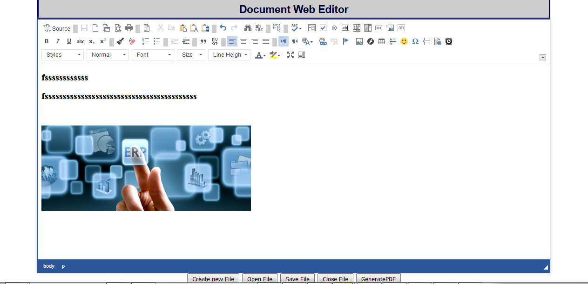

A database interactive WebDocument Editor that contains many feautres of Microsoft Office Online. Saving file into database and opening it from is a bonus!! Built with the help of ckeditor. All the plugins of ckeditor has been used here. After building a complete WYSIWYG from that and making it interactive with database gives us an extra feaure!!

